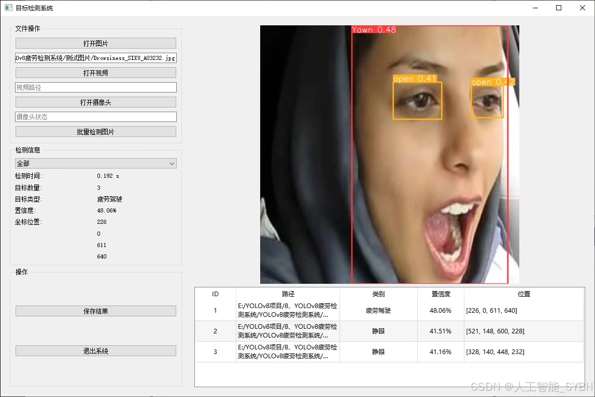
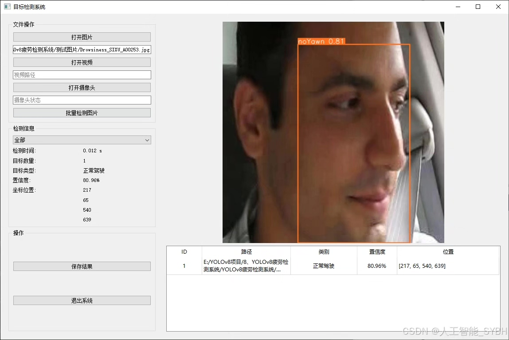
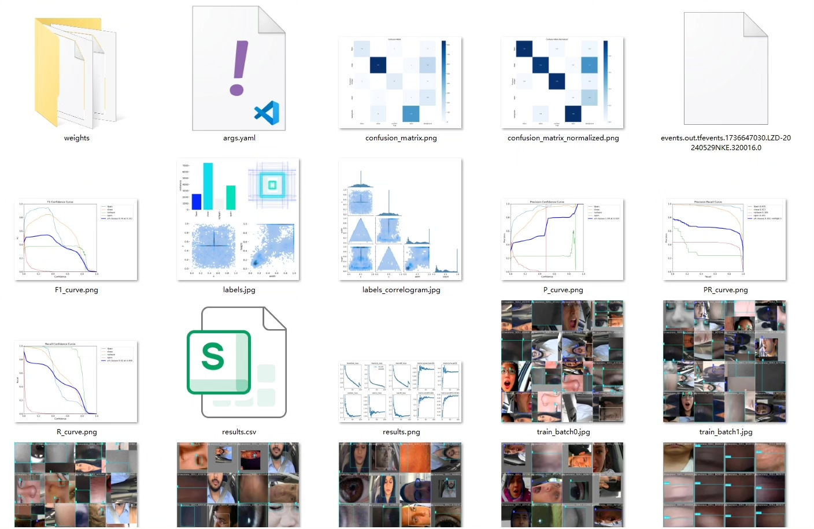
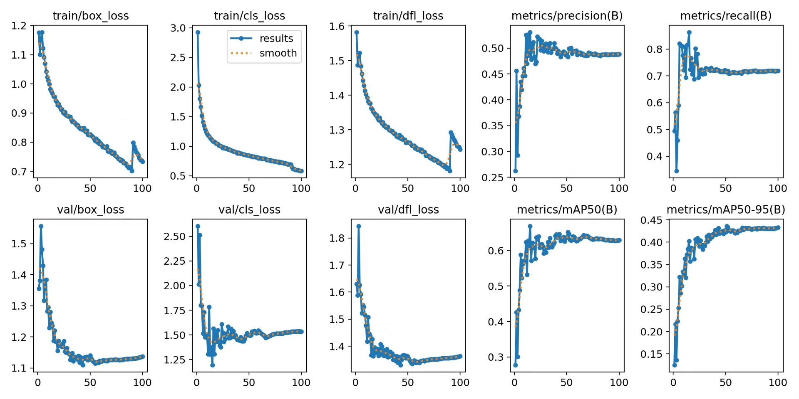
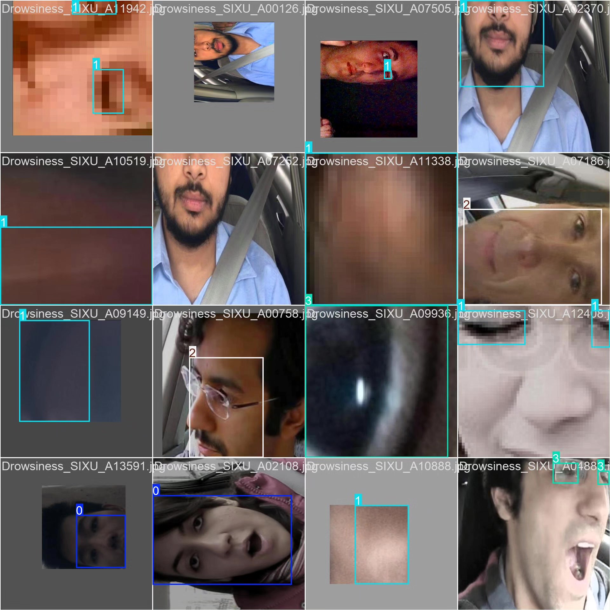

# Based on YOLOv8 deep learning for fatigue driving detection system (YOLOv8+Y)

## Body

Based on the YOLOv8 deep learning algorithm, a real-time fatigue driving detection system has been developed. This system can accurately identify the facial state and determine whether the driver is in a state of fatigue. The system can detect four key eye and mouth states: yawning (Yawn), closing eyes (close), not yawning (noYawn) and opening eyes (open). By analyzing the frequency and duration of these states, the system can accurately judge the driver's fatigue level and issue an alarm when dangerous states are detected, effectively preventing traffic accidents caused by fatigue driving.

Training set: A total of 13,719 images
Validation set: A total of 1,380 images
Test set: A total of 1,147 images

The company's products have obtained the official commercial license certification from YOLO.

Package after-sales service

After payment, we will provide WeChat ID for any questions.

Environment configuration: We will provide a tutorial on environment configuration, and WeChat will provide answers to questions.
Remote installation service: If you need remote configuration, an additional fee of 69 is required, with all fees refunded if the configuration fails (only refund installation fees for old computers).
Retraining dataset: After setting up the environment, you can train on your own computer. If you need us to retrain, just pay 69 + computing power fees (2.5 yuan/hour).
Full after-sales service

## Images

## Payment

Here is a pay link on Stripe ( https://buy.stripe.com/3cs8yP7sY87d0vu9AB ). Please contact me lonlonago@foxmail.com after funding $89, and I will send you a complete data files , thank you!

